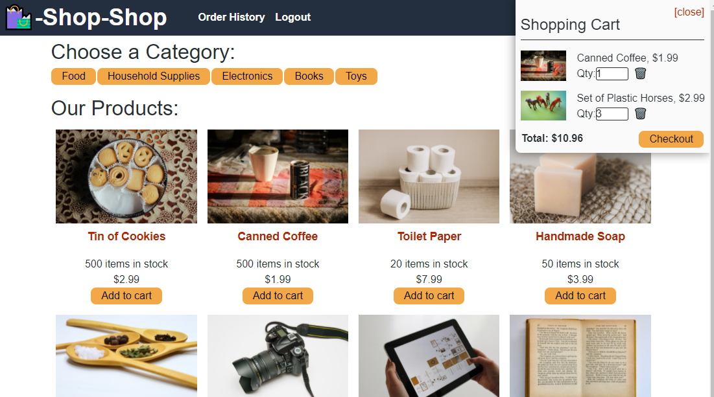

# Redux-Shop
---

  
  
   
   
   
   
   
## Description

This app is an e-commerce app that has both online and offline functionality.  It uses indexedDB and Stripe to allow for convenient shopping.

---
  ## Table of Contents

  [Features](#features)

  [Screenshot](#screenshot)

  [Installation](#installation)
    
  [Usage](#usage)
    
  [License](#license)
    
  [Contributing](#contributing)

  [Questions](#questions)
  
  

---

## Features

      1. IndexedDB for offline functionality 

      2. React for a fluid user experience 

      3. Redux to store the global state 

      4. Stripe to allow online shopping 
---

## Screenshot 
  
  
  

  ---

  ## Installation

      1. Either clone the repo 

      2.  Go to the deployed app 
---
  ## Usage

      1. npm start at the prompt 
      2. Click the link below to see the deployed app.
   [Heroku Deployed App ](https://tgtiburon-redux-shop.herokuapp.com/)

  ---
  ## License 

  &emsp; 

      To read about the license of this project click the link below.

  &emsp;[License](https://github.com/tgtiburon/Redux-Shop/blob/main/LICENSE) 

  ---
  ## Contributing

      1. Either leave a message at the github issues forum, or email me! 

---
## Questions

If you have any questions about this project feel free to email me at <tg.tiburon@gmail.com>.  

To see the rest of my portfolio, visit [Github](https://github.com/tgtiburon).

Below is a graphic displaying my most used languages on github.

This Readme file was created with Readme Architect by Tony Gendreau &copy;
